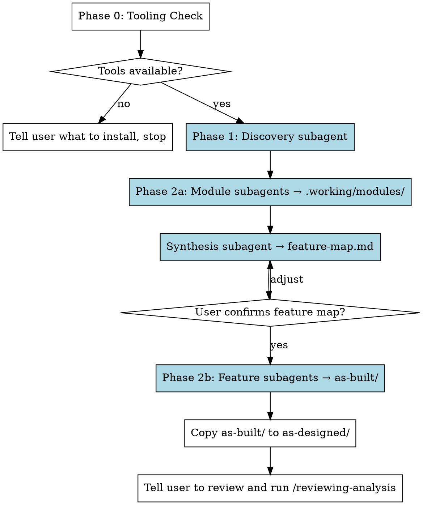

# Analyzing Codebase

## Overview

Produce a comprehensive functional analysis of a codebase, documenting what it actually does from a user's perspective. Output is structured markdown that humans edit to flag deviations from intended behavior.

**Core principle:** Two-pass analysis — first understand code structure (per-module), then synthesize into user-facing feature descriptions (per-feature). All heavy content lives in files, not agent context.

**Architecture:** The main agent is a pure orchestrator. It dispatches subagents, reads only compact summaries, and never holds full analysis in context. Subagents read from and write to a shared `.working/` directory.

```
docs/codebase-analysis/
├── .working/                    ← Intermediate files (subagent shared state)
│   ├── discovery.md             ← Phase 1 output
│   ├── modules/                 ← Pass 1 output: one file per module
│   ├── dependency-graph.md      ← Generated between passes
│   └── feature-map.md           ← Synthesis subagent output
├── as-built/                    ← Final output: what the code does
│   ├── overview.md
│   └── feature-*.md
└── as-designed/                 ← Copy for user to edit
    ├── overview.md
    └── feature-*.md
```

## Workflow



## Phase 0: Tooling Check

This is an **honest capability gate**, not a pass/fail check. The goal is to tell the user what fidelity they're going to get *before* heavy subagents run, and let them install a missing indexer or accept degraded coverage.

### Step 1 — ctags

Run as two separate Bash calls (not chained):
1. `ctags --version`
2. If it succeeds, check the output shows "Universal Ctags"

The Xcode-bundled ctags (`/usr/bin/ctags`) is useless. If missing or wrong version, tell the user: `brew install universal-ctags`. **Do not proceed without universal-ctags.**

### Step 2 — language presence

Run a single Glob for `**/*.swift`. If there are **zero Swift files**, skip to Phase 1.

### Step 3 — Swift indexer capability (only if Swift files are present)

Universal-ctags has no native Swift parser, so ctags alone gives near-zero Swift coverage. Check for each tier in priority order:

**Tier 1 — SourceKit-LSP + index-store (full fidelity, semantic cross-file refs):**
1. `command -v sourcekit-lsp` — if missing, skip to tier 2.
2. Check for a warm index-store:
   - `test -d <repo>/.build/*/index/store` (SwiftPM after `swift build`)
   - `test -d <repo>/.index/store` (custom `-index-store-path`)
   - Optionally: Xcode DerivedData path that matches this workspace.
3. If `sourcekit-lsp` is present but no index-store is warm, tier 1 is still *possible* via Swift 6.1+ background indexing with `--index-wait-seconds N`, but it's slower on first run and may miss refs.

**Tier 2 — SourceKitten (definitions only, no build required):** `command -v sourcekitten`.

**Tier 3 — grep only** (always available, floor).

Tier 1 is driven by the plugin's `scripts/swift-lsp-index.py` helper:

```bash
python3 ${CLAUDE_PLUGIN_ROOT}/skills/analyzing-codebase/scripts/swift-lsp-index.py \
  --workspace <repo-root> \
  --files <swift-file-1> ... \
  --with-references \
  [--index-wait-seconds N]
```

### Step 4 — present the honest picture

If ctags covers everything and no Swift files are present, say so in one line and proceed. Otherwise prompt the user plainly:

> I found N Swift files in this repo. Universal-ctags does not index Swift. Detected indexing options:
>
> - ✓ Tier 1 (SourceKit-LSP + warm `.build/.../index/store`) — full cross-file references, no extra work needed.
> — OR —
> - ⚠ Tier 1 possible (sourcekit-lsp present, no warm index-store) — I can either run `swift build` first (minutes, gives full fidelity) or rely on background indexing (slower first run, may miss some refs).
> — OR —
> - ✓ Tier 2 (SourceKitten) — Swift definitions only, no cross-file references.
> - ✗ Tier 3 (grep only) — approximate, misses actors/property wrappers/macros.
>
> Which would you like me to use? (1 / 1 with build / 1 with background indexing / 2 / 3 / abort)

Store the chosen tier (plus `swift_tier_wait` seconds for background-indexing case) and pass to every Phase 2a module subagent so they dispatch the right indexer per file.

**Bash intercept hook:** This plugin ships with a PreToolUse hook that blocks subagents from using shell commands (`ls`, `find`, `cat`, `awk`, etc.) when they should use dedicated tools. The hook is declared in this skill's frontmatter and activates automatically during skill execution.

## Phase 1: Discovery

Create a task: "Discover codebase structure"

Dispatch a subagent **(subagent_type=general-purpose)**. Read the prompt template from `references/discovery.md` in this skill directory and use it as the subagent prompt verbatim (it has no variables to substitute).

**Main agent reads ONLY the compact summary returned.** Mark task complete. Present to the user:

> "This is a {tech stack} project with N modules and ~N files. Starting module analysis..."

Do NOT read `.working/discovery.md` — that file is for later subagents.

**Save these values from the compact summary for later phases:**
- `TECH_STACK` → use as `{tech_stack}` in Phase 2a
- `MODULES` → the list of modules to dispatch in Phase 2a

## Phase 2a: Structural Analysis

**Create one task per module** from the MODULES list (e.g., "Analyze module: backend", "Analyze module: frontend"). This gives the user visibility into progress.

Dispatch **one subagent per module (subagent_type=general-purpose)** in parallel. Read the prompt template from `references/module-analysis.md`, substitute:
- `{module_path}` — the module path from the MODULES list
- `{module_name}` — the directory name (last path segment)
- `{tech_stack}` — the TECH_STACK value from Phase 1
- `{swift_tier}` — `none` if no Swift files in this module, else `1` (SourceKit-LSP driver), `2` (SourceKitten), or `3` (grep-only) from Phase 0's capability gate.
- `{swift_tier_wait}` — seconds to wait for background indexing (tier 1 with cold index-store); `0` otherwise.
- `{workspace_root}` — absolute path to the repo root (tier 1 needs it for the LSP driver).

**Mark each task complete** as its subagent returns. Main agent collects ONLY the compact summaries. Do NOT read `.working/modules/*.md`.

## Synthesis: Dependency Graph + Feature Mapping

Create a task: "Synthesize feature map"

Dispatch a **single subagent (subagent_type=general-purpose)**. Read the prompt template from `references/synthesis.md` and use it as the subagent prompt verbatim (no variables to substitute — the synthesis subagent reads entry points from `.working/discovery.md` directly).

After it returns, mark task complete. **Read ONLY `.working/feature-map.md`** (compact — just feature names, descriptions, module mappings). Present to the user:

> "I've identified N features: {list}. Does this grouping make sense, or should I split/merge any?"

**Wait for user confirmation before proceeding.**

## Phase 2b: Functional Analysis

**Create one task per feature** (e.g., "Analyze feature: Authentication", "Analyze feature: Billing").

Dispatch **one subagent per feature (subagent_type=general-purpose)** in parallel. Read the prompt template from `references/feature-analysis.md`, substitute:
- `{feature_name}` — the feature name from the feature map
- `{feature_slug}` — lowercase the feature name, replace spaces with hyphens (e.g., "User Authentication" → `user-authentication`)
- `{module_list}` — the "Contributing modules" from `.working/feature-map.md` for this feature
- `{entry_points}` — the "Entry points" from `.working/feature-map.md` for this feature
- `{module_files}` — convert each module name in `{module_list}` to `docs/codebase-analysis/.working/modules/{name}.md`, one path per line

**Mark each task complete** as its subagent returns.

**Main agent collects ONLY the compact status reports.** Do NOT read `as-built/feature-*.md`.

## Phase 3: Write Output

Create a task: "Write overview and finalize output"

The main agent does final assembly (lightweight — subagents already wrote the feature files):

1. **Write `overview.md`** to `docs/codebase-analysis/as-built/overview.md`:
   - Read the feature map from `.working/feature-map.md`
   - Read the dependency graph from `.working/dependency-graph.md`
   - Write: system purpose (1 paragraph), tech stack, component diagram (mermaid), feature table
2. **Check for existing `as-designed/` edits** — if `docs/codebase-analysis/as-designed/` already exists, warn the user: "as-designed/ already exists. Overwriting will lose your edits. Proceed?" Wait for confirmation before copying.
3. **Copy `as-built/` to `as-designed/`:**
   ```bash
   bash ${CLAUDE_PLUGIN_ROOT}/skills/analyzing-codebase/scripts/copy-to-as-designed.sh <project-root>
   ```
   Where `<project-root>` is the absolute path to the repo being analyzed.
4. **Mark task complete.** Tell the user:

> Analysis complete. I've written N feature documents to `docs/codebase-analysis/`.
>
> **Next steps:**
> 1. Review the files in `docs/codebase-analysis/as-designed/`
> 2. Edit them to reflect how things *should* work — fix descriptions, adjust business rules, add missing features, remove things that shouldn't exist
> 3. Leave `as-built/` untouched (it's the reference for what the code does)
> 4. When you're done editing, run `/reviewing-analysis` to identify deviations

## Execution Rules

**Do NOT enter plan mode.** This skill defines its own workflow with user checkpoints. If you find yourself in plan mode (e.g., the system auto-triggered it), write a minimal plan that says "Execute the /analyzing-codebase skill workflow" and immediately call ExitPlanMode to escape. Subagents cannot write files while plan mode is active, so the entire skill will fail if you stay in plan mode.

**Do NOT create directories with mkdir.** The Write tool creates parent directories automatically when writing files. Let subagents create directories implicitly by writing their output files.

**Do NOT use Bash for file operations.** No `ls`, `find`, `cat`, `head`, `tail`, `awk`, `wc`, `du`, `sort`, `cut`, `uniq`, `cp`, or any other shell command for reading, searching, or listing files. Use Glob, Grep, and Read tools instead. The only Bash commands allowed are `ctags`, `sourcekitten`, the `swift-lsp-index.py` driver (which wraps `sourcekit-lsp`), `command -v <tool>` and `test -d <path>` (Phase 0 capability detection), and the `copy-to-as-designed.sh` script in Phase 3.

**The main agent MUST follow these rules to stay within context limits:**

1. **Never read source files directly** — all analysis is done by subagents
2. **Never read `.working/modules/*.md` or `.working/discovery.md`** — only compact summaries
3. **Only read `.working/feature-map.md`** — the one compact file needed for user confirmation
4. **Never read `as-built/feature-*.md`** after subagents write them — trust status reports
5. **If you need to verify a subagent's output**, dispatch another subagent — do not read it yourself
6. **Read reference files one at a time, only when needed** — read `references/discovery.md` only at Phase 1, `references/module-analysis.md` only at Phase 2a, etc. Do NOT read all reference files upfront

## Error Handling

If a subagent returns output that does not match the expected compact format (e.g., missing MODULE: line, error messages instead of summary):
1. **Retry once** with the same prompt
2. If it fails again, **report to the user** which module/feature failed and ask how to proceed
3. **Never fall back to doing the work yourself** — that fills your context and defeats the architecture

If MODULE_COUNT is 0 or 1 from Phase 1, treat the entire repo as a single module. The synthesis step may produce only one or two features — this is fine for small projects.

## Common Mistakes

**Doing analysis work yourself** — The main agent is an orchestrator. If a subagent fails (e.g., can't write files), do NOT fall back to doing the work yourself. Diagnose why the subagent failed, fix the issue, and re-dispatch. Doing the work yourself fills your context and defeats the architecture.

**Reading subagent output into main context** — The whole point of file-based coordination is keeping heavy content out of the main agent. If you read full module analyses or source files, you've defeated the purpose.

**Organizing by code structure instead of features** — The output must be user-facing feature descriptions, not module-by-module code docs. A feature like "Authentication" spans multiple modules.

**Vague business rules** — "Validates input" is useless. "Email must match RFC 5322, password minimum 8 characters with at least one number" is useful. Always include source location.

**Missing business rules** — Look in validators, middleware, UI component conditional rendering, database constraints, config files. Business rules hide everywhere.

**Skipping the feature map confirmation** — Always pause after the feature map to let the user confirm the grouping. Getting the feature boundaries wrong wastes all of Phase 2b.

**Using Bash for file operations** — NEVER use ls, find, cat, head, tail, awk, du, wc, sort, cut, uniq, cp, or ANY shell command to explore files. Use Glob to find files, Grep to search content, Read to read files. The only allowed Bash commands are ctags, sourcekitten, the `swift-lsp-index.py` driver, `command -v` / `test -d` (Phase 0 only), and the copy-to-as-designed.sh script.
