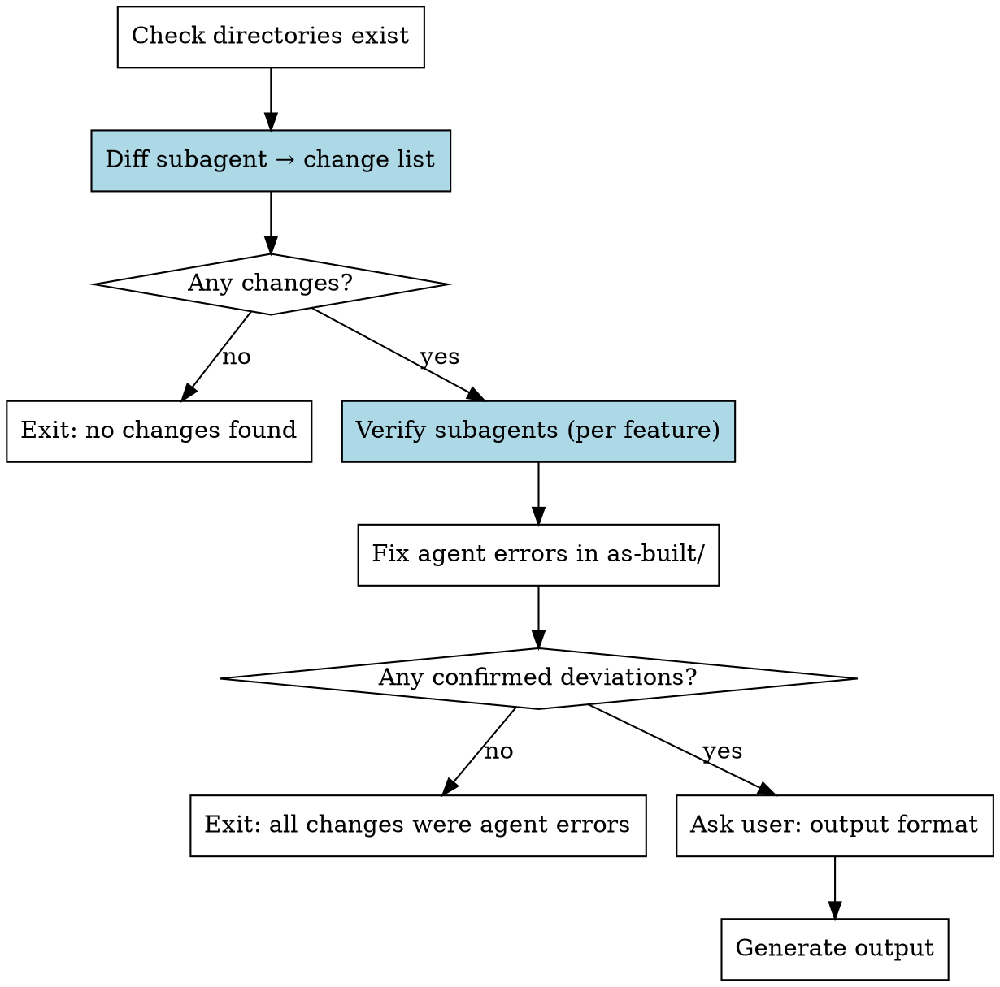

# Reviewing Analysis

## Overview

Compare user-edited `as-designed/` files against `as-built/` documentation to identify deviations between intended and actual codebase behavior. Verify each deviation against the source code, correct agent errors, and output confirmed deviations as GH issues, markdown report, or both.

**Architecture:** The main agent is a pure orchestrator. It dispatches subagents, reads only compact summaries, and never reads as-built/ or as-designed/ files directly.

## Workflow



## Step 1: Check Prerequisites

Use Glob to verify both directories exist:
- `docs/codebase-analysis/as-built/`
- `docs/codebase-analysis/as-designed/`

If missing, tell the user to run `/as-designed-review:analyzing-codebase` first.

**Do NOT read any files in these directories.** The diff subagent handles that.

## Step 2: Diff (subagent)

Create a task: "Diff as-built vs as-designed"

Dispatch a **single subagent (subagent_type=general-purpose)**. Use this prompt:

```
Compare all file pairs between docs/codebase-analysis/as-built/ and docs/codebase-analysis/as-designed/.

Tool rules: Use Glob to find files, Read to read them. No Bash commands.

Steps:
1. Glob both directories to list files
2. For each matching pair, Read both files and identify all differences
3. For each difference, note: which file, which section, what changed (original vs edited)

Write the full diff report to: docs/codebase-analysis/.working/diff-report.md

Format:
# Diff Report

## {feature-file-name}.md
### Change 1: {short description}
- **Section:** {Business Rules / What It Does / User Flows / etc.}
- **As-built says:** {original text}
- **As-designed says:** {user's edited text}

(repeat for all changes in all files)

Return ONLY this compact summary:

FILES_WITH_CHANGES: {comma-separated feature file names}
TOTAL_CHANGES: {number}
UNCHANGED_FILES: {count}
```

**Main agent reads ONLY the compact summary.** If TOTAL_CHANGES is 0, exit: "No changes found between as-built and as-designed."

## Step 3: Verify Against Code (subagents per feature)

**Create one task per changed feature** from the FILES_WITH_CHANGES list.

Dispatch **one subagent per feature (subagent_type=general-purpose)** in parallel. Use this prompt:

```
The user has reviewed the analysis of the "{feature_name}" feature and made changes.
Your job: verify each change against the actual source code.

Tool rules: Use Glob to find files, Grep to search content, Read to read files. Bash is ONLY for ctags. No ls/find/cat/awk or other shell commands.

Read the diff report section for this feature from: docs/codebase-analysis/.working/diff-report.md
Read the as-built file: docs/codebase-analysis/as-built/{feature_file}
(The Key Files table in the as-built file tells you which source files to check.)

For EACH change the user made, read the relevant source code and determine:

1. **Agent error** — the code actually matches what the user wrote (as-designed).
   The original as-built description was wrong.

2. **Confirmed deviation** — the code genuinely does what as-built says, not what
   the user wrote in as-designed. This is a real gap.

Write your verification to: docs/codebase-analysis/.working/verification-{feature_slug}.md

Return ONLY:

FEATURE: {feature_name}
AGENT_ERRORS: {count}
CONFIRMED_DEVIATIONS: {count}
DEVIATION_TYPES: {comma-separated: "implementation differs", "missing functionality", "unwanted functionality"}
```

**Mark each task complete** as its subagent returns. Main agent collects ONLY the compact summaries.

## Step 4: Fix Agent Errors

Read ONLY the verification files for features that reported AGENT_ERRORS > 0:
- `docs/codebase-analysis/.working/verification-{feature_slug}.md`

For each agent error, update the corresponding `as-built/` file to match reality. These are not deviations — the agent got it wrong in the first analysis.

## Step 5: Output Deviations

If any features reported CONFIRMED_DEVIATIONS > 0, ask the user using AskUserQuestion:

> How should I output the confirmed deviations?
> - GitHub Issues
> - Markdown report
> - Both

### Markdown Report

Read the verification files for features with confirmed deviations. Write to `docs/codebase-analysis/deviation-report.md`:

```markdown
# Codebase Analysis — Deviation Report

Generated: YYYY-MM-DD

## Summary
- Features analyzed: N
- Deviations found: N
  - Implementation differs: N
  - Missing functionality: N
  - Unwanted functionality: N
- Agent errors corrected: N

## Deviations

### 1. {Short description}
- **Feature:** {feature name}
- **As-built:** {what the code does}
- **As-designed:** {what the user intended}
- **Location:** {file:line}
- **Type:** Implementation differs | Missing functionality | Unwanted functionality
```

### GitHub Issues

Create one issue per deviation. Run each `gh` command as a **separate Bash call** (not chained).

First check/create the label:
```bash
gh label create codebase-analysis --description "Deviations identified by codebase analysis" --color "d4c5f9"
```

Then for each deviation:
```bash
gh issue create --title "[Deviation] {short description}" --label "codebase-analysis" --body "$(cat <<'EOF'
## Deviation
- **As-built:** {what the code does}
- **As-designed:** {what the user intended}

## Location
- {file:line}

## Type
{type}
EOF
)"
```

Before creating issues, check for existing issues with the `codebase-analysis` label to avoid duplicates.

## Step 6: Summary

Present findings as tables. Use this format:

**Confirmed Deviations**

| # | Feature | Description | Type | Location |
|---|---------|-------------|------|----------|
| 1 | {feature} | {what's wrong — one clear sentence} | Implementation differs / Missing functionality / Unwanted functionality | {file:lines} |

**Agent Errors Corrected** (as-built was wrong)

| Feature | What was wrong |
|---------|---------------|
| {feature} | {what the agent got wrong — one sentence} |

**User Edit Contradictions** (if any found during verification)

Flag cases where the user's edits contradict each other across files or sections. Quote the conflicting text and ask which version they intend.

**Totals:**
```
Files compared: N | Changes found: N | Deviations: N | Agent errors corrected: N | Output: {format}
```

## Execution Rules

**Do NOT enter plan mode.** This skill defines its own workflow. If auto-triggered, write a minimal plan and ExitPlanMode.

**The main agent MUST NOT read as-built/ or as-designed/ files directly.** All reading and comparison is done by subagents. The main agent reads only:
- Compact summaries returned by subagents
- Verification files (only for features with agent errors, to fix as-built/)

**Do NOT use Bash for file operations.** Use Glob, Grep, and Read tools.

## Common Mistakes

**Doing the diff yourself** — The main agent must dispatch a diff subagent. Reading all file pairs fills your context.

**Assuming reworded text is cosmetic** — Always verify against the code. The user may have corrected a factual error.

**Skipping verification** — Every change gets a subagent verification. No exceptions.

**Creating duplicate GH issues** — Check for existing issues with the `codebase-analysis` label first.
