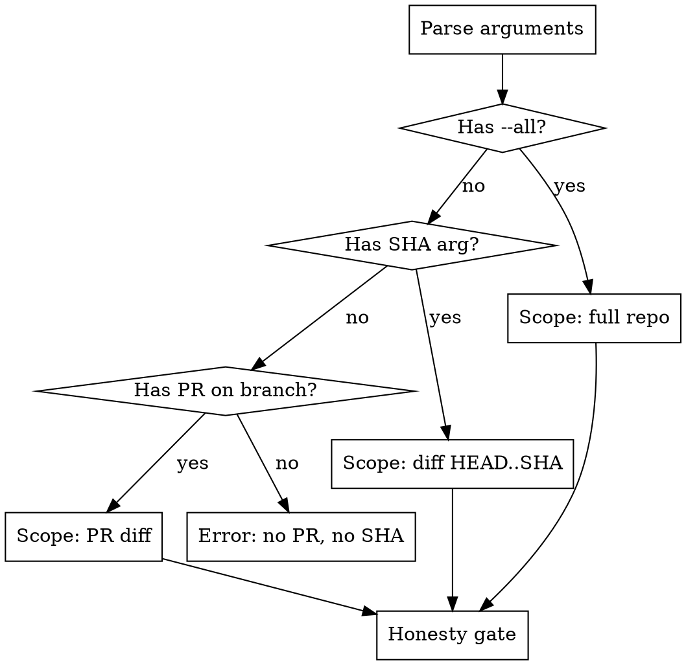

# Day 1 Review

Analyze code for structural debt — find what wouldn't exist if the codebase were correct from day 1.

**Core principle:** Structural debt is relational, not local. A shim is only identifiable as debt when you trace its callers. A hidden default only matters in context of what reads it. Build the dependency graph first, then reason about what shouldn't be there.

**Architecture:** Three-phase pipeline. Phase 1 (graph extraction) and Phase 2 (candidate selection) are mechanical. Phase 3 (semantic evaluation) uses Opus agents with curated context. The orchestrator merges results and presents for user approval.

**Output:** Two specs compatible with `superpowers:writing-plans` — one for high-confidence fixes, one for items needing human judgment.

## Scope Resolution



**PR mode (default):**
```bash
gh pr view --json number,url,headRefName,baseRefName
```
```bash
git diff <baseRefName>...<headRefName> --name-only
```

**SHA mode:**
```bash
git diff <sha>...HEAD --name-only
```

**Full repo mode (`--all`):**
Use Glob to enumerate all source files. No diff — analyze everything.

### Honesty Gate

Before proceeding, estimate scope and be honest about limits:

```bash
# Count changed files (PR/SHA mode)
git diff <base>...<head> --stat
```

If the scope exceeds what can be meaningfully analyzed:
- **>200 changed files (PR/SHA mode):** Warn the user. Suggest scoping to specific directories.
- **>500 files or >100k lines (--all mode):** Warn the user. Suggest passing a directory path instead.
- **Do NOT silently produce shallow results.** Be explicit about what you can and cannot cover.

## Phase 1: Graph Extraction

Dispatch a subagent (standard model) to build the dependency graph mechanically.

**Subagent prompt:** Use `${CLAUDE_PLUGIN_ROOT}/skills/day-1-review/references/graph-extraction.md`

The subagent:
1. Runs `ctags` on all in-scope files to build a symbol index (definitions + references)
2. Traces imports/exports across files
3. Expands two hops outward from changed files:
   - **Hop 0:** Changed files (full content available)
   - **Hop 1:** Direct dependents and dependencies (files that import/call or are imported/called by changed files)
   - **Hop 2:** Files connecting hop-1 nodes to each other (bridging context)
4. Writes structured graph to `.working/dependency-graph.json`

**Output format:**
```json
{
  "scope": {"mode": "pr", "base": "main", "files_analyzed": 12, "files_in_graph": 34},
  "nodes": [
    {"id": "shimV1", "file": "src/adapter.ts", "line": 15, "type": "function", "hop": 0},
    {"id": "newImpl", "file": "src/core.ts", "line": 42, "type": "function", "hop": 1}
  ],
  "edges": [
    {"from": "shimV1", "to": "newImpl", "type": "calls"},
    {"from": "legacyHandler", "to": "shimV1", "type": "calls"}
  ]
}
```

For `--all` mode, skip hop expansion — the entire repo is in scope.

**IMPORTANT:** The graph subagent uses only deterministic tools (ctags, Grep, Glob). It does NOT reason about whether something is debt — it maps structure.

## Phase 2: Candidate Selection

The orchestrator reads `.working/dependency-graph.json` and runs mechanical pattern queries to identify debt candidates. No subagent needed.

### Debt Categories and Graph Signals

| # | Category | Graph Signal | Phase 2 can detect? |
|---|----------|-------------|---------------------|
| 1 | **Dead code** | Symbol has 0 callers/importers | Yes |
| 2 | **Dead shim** | Symbol has ≤5 callers AND body delegates to another function | Partially — needs Phase 3 to confirm pass-through |
| 3 | **Commented-out code** | Code blocks inside comments | Yes (grep for patterns) |
| 4 | **Unresolved TODOs/FIXMEs** | Comment markers in changed files | Yes (grep) |
| 5 | **Vestigial dependency** | Package in manifest imported only by changed/removed code | Yes |
| 6 | **Orphaned config** | Config key grep shows 0 or only removed readers | Yes |
| 7 | **Zombie feature flag** | Flag checked but never toggled | Partially |
| 8 | **Naming inconsistency** | Mixed conventions for same concept, or API aliases used inconsistently | Partially |
| 9 | **Spurious includes/imports** | Import with no usage of imported symbols | Yes |
| 10 | **Stale documentation** | Doc references symbols modified/removed in diff | Yes |
| 11 | **Missing documentation** | Public exports with no doc coverage | Yes |
| 12 | **Orphaned documentation** | Doc files referencing nonexistent code | Yes |
| 13 | **Hidden defaults (magic values)** | Hardcoded literals in function bodies | Partially — needs Phase 3 for judgment |
| 14 | **Hidden defaults (implicit behavior)** | Silent fallbacks, swallowed errors | No — needs Phase 3 |
| 15 | **Backwards-compat shim** | Wrapper patterns, adapter layers | No — needs Phase 3 |
| 16 | **Undocumented defaults** | Default values with no doc reference | Partially |

For each candidate, attach mechanical evidence:
- File location(s) and line numbers
- Caller/reference count from graph
- Whether tests reference it
- Relevant diff hunks

Write all candidates to `.working/candidates.json`.

### What Phase 2 Must NOT Do

- **Do not flag bugs.** Bugs (wrong logic, incorrect behavior) are not structural debt. Structural debt is code that works but shouldn't exist. If the code is broken, that's a different tool's job.
- **Do not flag style issues.** Formatting, indentation, and linting concerns are not structural debt.
- **Do not read source files.** Use only the graph data and grep results. Save source reading for Phase 3.

## Phase 3: Semantic Evaluation

Dispatch Opus-model agents to evaluate candidates that Phase 2 couldn't fully resolve. These handle the categories requiring judgment: hidden defaults, shims, implicit behavior, documentation quality.

**Subagent prompt:** Use `${CLAUDE_PLUGIN_ROOT}/skills/day-1-review/references/semantic-evaluation.md`

### Dispatch Strategy

Group candidates by connected component in the dependency graph. Dispatch one Opus agent per component. Each agent receives:

1. **The diff** (relevant portion only)
2. **The dependency subgraph** (structured JSON for this component)
3. **Candidate list** (from Phase 2, for this component)
4. **Source context:**
   - Hop 0 files: full text
   - Hop 1 files: relevant functions/classes only
   - Hop 2 files: signatures and docstrings only
5. **Debt pattern templates** (from `references/debt-taxonomy.md`)

Each agent evaluates candidates AND looks for additional debt the graph queries missed. Returns structured findings.

### Classification Framework

Each finding is classified on three axes, adapted from [Riot Games' taxonomy](https://www.riotgames.com/en/news/taxonomy-tech-debt) for the agentic era:

**Three Axes (1-5 each):**

| Axis | Meaning |
|------|---------|
| **Impact** | How much does this debt hurt developers/users? |
| **Confidence** | How certain are we that removal is safe without human judgment? Replaces "Fix Cost" — coding cost is ~zero with agents. What's still expensive is verification. |
| **Contagion** | Will this spread? Will new code copy the pattern? |

**Four Debt Types:**

| Type | Meaning | Examples |
|------|---------|----------|
| **Local** | Self-contained, safe to remove | Dead code, resolved TODOs, orphaned config, spurious imports |
| **MacGyver** | Duct-tape between old and new approaches | Shims, compat layers, conversion functions |
| **Foundational** | Assumptions baked into architecture | Hidden defaults, implicit behavior, undocumented invariants |
| **Data** | Content/config built on flawed foundations | Config relying on buggy defaults, test fixtures encoding wrong assumptions |

### What Phase 3 Must NOT Do

- **Do not flag bugs as debt.** If code is broken, note it briefly as an aside but do not include it in the debt findings. Debt is code that works but shouldn't exist.
- **Do not invent hypothetical debt.** Every finding must have concrete evidence from the code.

## Output Assembly

The orchestrator reads Phase 3 results, merges with Phase 2 confirmed findings, deduplicates, and presents.

### Presentation Format

**Detail section — one block per finding:**

```markdown
### N. [Short description]
- **File(s):** path/to/file.ts:42 (+ N related files)
- **Category:** Dead code | Dead shim | Hidden default | ...
- **Debt type:** Local | MacGyver | Foundational | Data
- **Impact:** 3/5 — [why]
- **Confidence:** 5/5 — [why, e.g. "zero callers, no dynamic references"]
- **Contagion:** 2/5 — [why]
- **Evidence:** [what the graph/agent found — be specific]
- **Recommendation:** Remove | Inline | Document | Consolidate | Needs your call
- **What's unknown:** [only for confidence < 4 — what we can't verify]
```

**Summary table at bottom:**

```markdown
## Summary

| # | Category | Location | Description | Type | Imp | Conf | Cont | Rec |
|---|----------|----------|-------------|------|-----|------|------|-----|
| 1 | Dead shim | adapter.ts:15 | shimV1() 2 callers, pass-through | MacGyver | 2 | 5 | 3 | Inline |
| 2 | Hidden default | config.ts:88 | timeout=30 undocumented | Foundational | 4 | 2 | 4 | Your call |

Ready to fix: N | Needs your call: N
```

Ask the user to approve or adjust before writing specs.

## Writing Specs

After user approval, write two documents:

### "Ready to fix" spec (confidence >= 4)

**Path:** `docs/day-1-review/YYYY-MM-DD-ready-to-fix.md`

Structure this as input for `superpowers:writing-plans`:

```markdown
# Day 1 Review: Ready to Fix

> **For Claude:** Use superpowers:writing-plans to create an implementation plan from this spec.

**Goal:** Remove structural debt identified by day-1-review with high confidence.

**Scope:** [files/modules affected]

---

### Finding 1: [Description] (Category: [X], Type: [Y])
- **Files:** [locations]
- **Evidence:** [what was found]
- **Fix:** [specific action — remove, inline, document, consolidate]
- **Verification:** [how to confirm the fix is safe]

### Finding 2: ...
```

### "Needs your call" spec (confidence < 4)

**Path:** `docs/day-1-review/YYYY-MM-DD-needs-decision.md`

Present the user's decisions. After they decide on each item, write the same `writing-plans`-compatible format for the approved items.

Tell the user:
> Specs written. Run `/superpowers:writing-plans` on either file when you're ready to create an implementation plan.

## Workflow Summary

```
 1. Resolve scope (PR / SHA / --all)
 2. Honesty gate — warn if too large
 3. Phase 1: Graph extraction subagent (standard model)
 4. Phase 2: Candidate selection (orchestrator, mechanical)
 5. Phase 3: Semantic evaluation (Opus subagents per component)
 6. Merge, deduplicate, classify
 7. Present report — detail blocks + summary table
 8. User approves / adjusts
 9. Write "ready to fix" spec
10. Present "needs your call" items
11. User decides
12. Write "needs your call" spec
```

## Common Mistakes

**Analyzing locally instead of relationally.** The #1 failure mode is checking each file in isolation. A function with 3 callers looks fine alone — until you trace those callers and realize they all also call the underlying implementation directly, making the function a dead shim. Always use the dependency graph.

**Mixing bugs with debt.** A wrong `#ifdef` is a bug. A shim that's no longer needed is debt. Both are problems, but they require different tools and workflows. If you find a bug, mention it as an aside but do not include it in the debt report.

**Inventing hypothetical debt.** "This could be a problem if..." is not a finding. Every item must have concrete evidence from the code and the graph.

**Skipping the honesty gate.** Producing a shallow analysis of 500 files is worse than a thorough analysis of 50. If the scope is too large, say so.

**Classifying everything as high impact.** Use the axes honestly. Dead code with zero callers has zero contagion. An orphaned config key nobody reads has low impact. Save the high scores for things that actively spread or hurt developers.
