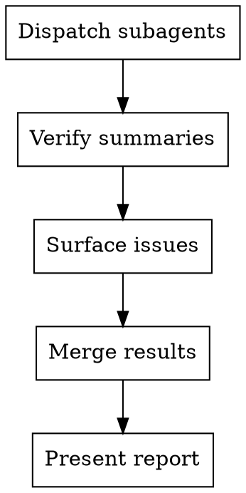
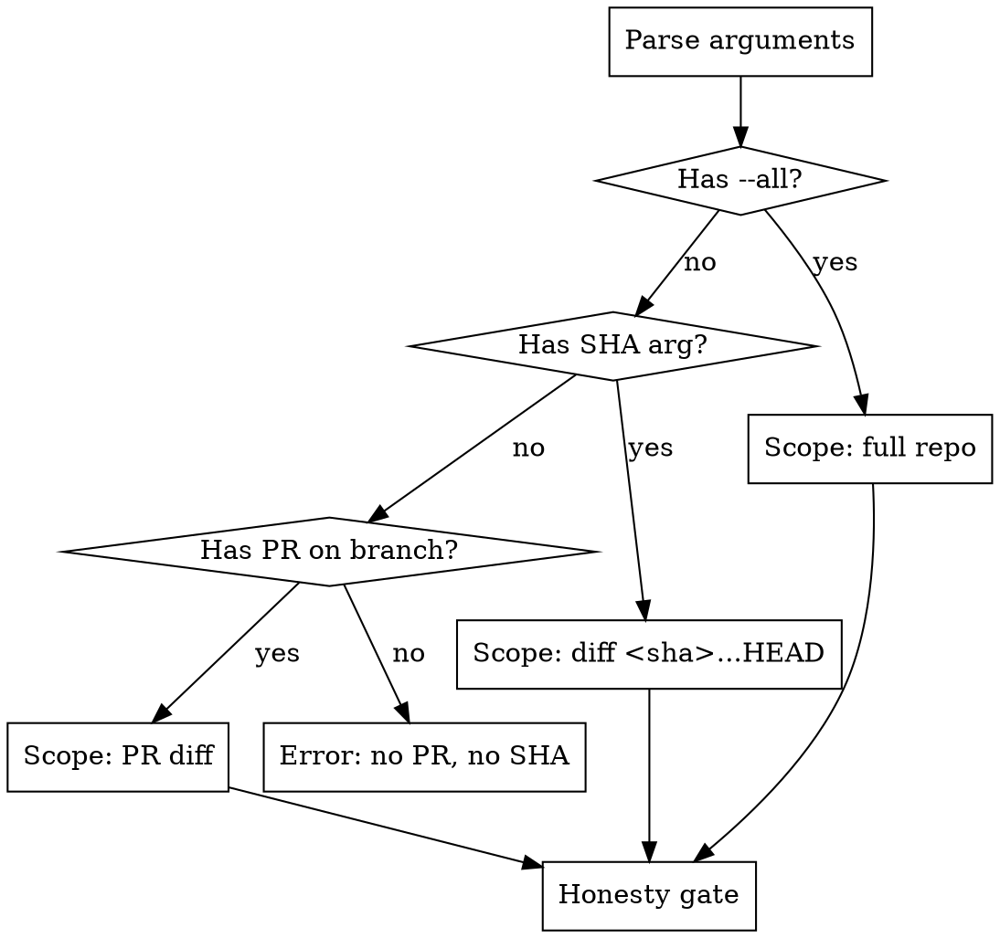

# Day 1 Review

Analyze code for structural debt — find what wouldn't exist if the codebase were correct from day 1.

**Core principle:** Structural debt is relational, not local. A shim is only identifiable as debt when you trace its callers. A hidden default only matters in context of what reads it. Build the dependency graph first, then reason about what shouldn't be there.

**Architecture:** Three-phase pipeline executed entirely by subagents. The orchestrator dispatches, verifies, and presents — it never reads source code.

**Output:** Two specs compatible with `superpowers:writing-plans` — one for high-confidence fixes, one for items needing human judgment.

## Orchestrator Rules

**You are a dispatcher and verifier, not an executor.**



**You MUST NOT:**
- Read source files (via Read, cat, head, tail, or any other mechanism)
- Read `.working/dependency-graph.json` or any intermediate data file
- Run Grep or Glob against the codebase
- Run ctags
- Perform any analysis that belongs to a subagent

**You MUST:**
- Dispatch subagents **using the Agent tool** — it is available to you. Read the reference prompt file, include its content in the Agent prompt along with the file list and any other inputs specified.
- Verify subagent summaries for completeness (see Verification section)
- Surface subagent issues and recommendations to the user
- Merge structured results from subagent responses
- Present the report and write specs after user approval

**Red flags — if you catch yourself doing any of these, STOP:**

| Thought | What to do instead |
|---------|--------------------|
| "Let me read the source to understand..." | Dispatch a subagent |
| "I'll just quickly grep for..." | That's a subagent's job |
| "Let me check the dependency graph..." | Read the subagent's summary, not the file |
| "I need to read these files to prepare..." | No. Subagents prepare themselves |
| "Just a few files won't hurt..." | At 1M lines "a few" becomes thousands. Delegate. |
| "The Agent tool isn't available..." | It is. You are a subagent yourself — the Agent tool is available to subagents. Use it. |
| "I'll simulate the subagent work myself..." | No. Dispatch a real subagent. The whole point is context isolation. |

## Scope Resolution



**PR mode (default):**
```bash
gh pr view --json number,url,headRefName,baseRefName
```
```bash
git diff <baseRefName>...<headRefName> --name-only
```

**SHA mode:**
```bash
git diff <sha>...HEAD --name-only
```

**Full repo mode (`--all`):**
Run `git ls-files` to enumerate tracked source files. No diff — analyze everything.

### Bash Command Guidelines

Avoid compound commands (`cd /path && git ...`) — they trigger consent prompts. Use `git -C <path>` instead:
```bash
# YES
git -C /path/to/repo ls-files
# NO — triggers consent prompt
cd /path/to/repo && git ls-files
```

### File Exclusions

After resolving scope, build the file list and filter out:

- **`.claude/`** — local settings and memory, not project code
- **Files matched by `.gitignore`** — generated artifacts, dependencies, build output
- **Binary files** — images (`.png`, `.jpg`, `.bmp`, `.gif`, `.ico`, `.raw`, `.rgb`), compiled assets (`.o`, `.so`, `.dll`, `.wasm`), archives (`.zip`, `.tar`, `.gz`), office files (`.pptx`, `.docx`, `.xlsx`, `.pdf`), and other non-text files

Tell the user what you're excluding and how many files were filtered, e.g.:

> Excluding 3 files: `.claude/settings.local.json` and 2 gitignored files. Analyzing 9 remaining files.

For PR/SHA mode, apply exclusions to the diff file list. For `--all` mode, apply when enumerating source files.

### Honesty Gate

Before proceeding, estimate scope and be honest about limits:

```bash
# Count changed files (PR/SHA mode)
git diff <base>...<head> --stat
```

If the scope exceeds what can be meaningfully analyzed:
- **>200 changed files (PR/SHA mode):** Warn the user. Suggest scoping to specific directories.
- **>500 files or >100k lines (--all mode):** Warn the user. Suggest scoping to a specific PR or SHA instead, or manually limiting the set of files analyzed.
- **Do NOT silently produce shallow results.** Be explicit about what you can and cannot cover.

## Data Flow

```
Orchestrator
  │
  ├─ Scope resolution (git commands only)
  ├─ Honesty gate
  │
  ├─ Dispatch Phase 1: Graph Extraction (standard model)
  │    └─ Writes .working/dependency-graph.json
  │    └─ Returns {summary, issues, recommendations}
  │
  ├─ Verify Phase 1 summary
  │
  ├─ Dispatch Phase 2 in parallel (3 groups):
  │    ├─ Group A: graph-dependent patterns (waits for Phase 1)
  │    │    └─ Reads .working/dependency-graph.json
  │    │    └─ Returns {summary, issues, recommendations, candidates, components}
  │    ├─ Group B: grep-only patterns (starts immediately)
  │    │    └─ Returns {summary, issues, recommendations, candidates}
  │    └─ Group C: manifest/config patterns (starts immediately)
  │         └─ Returns {summary, issues, recommendations, candidates}
  │
  ├─ Verify Phase 2 summaries
  ├─ Surface issues/recommendations to user
  │
  ├─ Dispatch Phase 3: Opus agents per connected component
  │    └─ Partitioning from Group A's "components" output
  │    └─ Loose candidates → one extra agent
  │    └─ Each returns {summary, issues, recommendations, findings}
  │
  ├─ Verify Phase 3 summaries
  │
  ├─ Merge, deduplicate, present report
  └─ Write specs after user approval
```

**Parallelism:** Groups B and C do not need the dependency graph. Dispatch them immediately after scope resolution, in parallel with Phase 1. Group A must wait for Phase 1 to complete.

**Intermediate files** (`.working/dependency-graph.json`) are handoff mechanisms between subagents. The orchestrator knows the paths but never reads the contents.

## Subagent Output Contract

All subagents return the same top-level structure:

```json
{
  "summary": {
    "files_expected": 21,
    "files_processed": 21,
    "skipped": [],
    "patterns_run": ["dead-code", "spurious-import"],
    "candidates_found": 7
  },
  "issues": [
    "ctags not installed — fell back to grep-based tracing"
  ],
  "recommendations": [
    "Re-run with --all to catch cross-module dead code"
  ],
  "candidates": []
}
```

- **summary**: Mechanical accounting so the orchestrator can verify completeness.
- **issues**: Problems the subagent encountered. Surfaced to the user.
- **recommendations**: Suggestions based on what the subagent observed. Surfaced to the user.
- **candidates** (Phase 2) or **findings** (Phase 3): The actual results.

Subagents are first-class participants — they report what they observed, not just what they found.

## Phase 1: Graph Extraction

Dispatch a subagent (standard model) to build the dependency graph mechanically.

**Subagent prompt:** Use `${CLAUDE_PLUGIN_ROOT}/skills/day-1-review/references/graph-extraction.md`

**Input:** The file list from scope resolution.

The subagent:
1. Runs `ctags` on all in-scope files to build a symbol index (definitions + references)
2. Traces imports/exports across files
3. Expands two hops outward from changed files (PR/SHA mode only):
   - **Hop 0:** Changed files (full content available)
   - **Hop 1:** Direct dependents and dependencies
   - **Hop 2:** Files connecting hop-1 nodes to each other
4. Writes structured graph to `.working/dependency-graph.json`
5. Returns summary, issues, and recommendations to the orchestrator

For `--all` mode, skip hop expansion — the entire repo is in scope.

**IMPORTANT:** The graph subagent uses only deterministic tools (ctags, Grep, Glob). It does NOT reason about whether something is debt — it maps structure.

## Phase 2: Candidate Selection

Dispatched as three parallel subagent groups, split by input dependency.

### Group A: Graph-Dependent Patterns

**Patterns:** Dead code, dead shims, spurious imports, zombie feature flags, naming inconsistencies.

**Subagent prompt:** Use `${CLAUDE_PLUGIN_ROOT}/skills/day-1-review/references/graph-candidates.md`

**Input:**
- File list (passed by orchestrator)
- Reads `.working/dependency-graph.json` (written by Phase 1)

**Additional responsibility:** Produce a `components` array mapping candidates to connected components in the dependency graph. This partitioning drives Phase 3 dispatch.

### Group B: Grep-Only Patterns

**Patterns:** TODOs/FIXMEs, commented-out code, hardcoded credentials, stale docs, missing docs, orphaned docs.

**Subagent prompt:** Use `${CLAUDE_PLUGIN_ROOT}/skills/day-1-review/references/grep-candidates.md`

**Input:** File list only. No graph needed.

### Group C: Manifest/Config Patterns

**Patterns:** Vestigial dependencies, orphaned config, bloated gitignore.

**Subagent prompt:** Use `${CLAUDE_PLUGIN_ROOT}/skills/day-1-review/references/manifest-candidates.md`

**Input:** File list only. Cross-references manifests against source imports.

### Debt Categories and Phase 2 Signals

| # | Category | Graph Signal | Group |
|---|----------|-------------|-------|
| 1 | **Dead code** | Symbol has 0 callers/importers | A |
| 2 | **Dead shim** | Symbol has ≤5 callers AND delegates to another function | A (candidate) |
| 3 | **Commented-out code** | Code blocks inside comments | B |
| 4 | **Unresolved TODOs/FIXMEs** | Comment markers in changed files | B |
| 5 | **Vestigial dependency** | Package in manifest imported only by changed/removed code | C |
| 6 | **Orphaned config** | Config key grep shows 0 or only removed readers | C |
| 7 | **Zombie feature flag** | Flag checked but never toggled | A (candidate) |
| 8 | **Naming inconsistency** | Mixed conventions for same concept | A |
| 9 | **Spurious includes/imports** | Import with no usage of imported symbols | A |
| 10 | **Stale documentation** | Doc references symbols modified/removed in diff | B (PR/SHA only) |
| 11 | **Missing documentation** | Public exports with no doc coverage | B |
| 12 | **Orphaned documentation** | Doc files referencing nonexistent code | B |
| 13 | **Hidden defaults (magic values)** | Hardcoded literals in function bodies | B (candidate) |
| 14 | **Hidden defaults (implicit behavior)** | Silent fallbacks, swallowed errors | Phase 3 only |
| 15 | **Backwards-compat shim** | Wrapper patterns, adapter layers | Phase 3 only |
| 16 | **Undocumented defaults** | Default values with no doc reference | B (candidate) |

### What Phase 2 Must NOT Do

- **Do not flag bugs.** Bugs are not structural debt. Structural debt is code that works but shouldn't exist.
- **Do not flag style issues.** Formatting, indentation, and linting are not structural debt.
- **Do not perform open-ended source reading or semantic analysis.** Bounded mechanical reads (grep results, checking for docstrings, reading config files) are fine. Save in-depth source comprehension for Phase 3.

## Phase 3: Semantic Evaluation

Dispatch Opus-model agents to evaluate candidates that Phase 2 couldn't fully resolve. These handle the categories requiring judgment: hidden defaults, shims, implicit behavior, documentation quality.

**Subagent prompt:** Use `${CLAUDE_PLUGIN_ROOT}/skills/day-1-review/references/semantic-evaluation.md`

### Dispatch Strategy

Use Group A's `components` output to partition work. Dispatch one Opus agent per connected component.

**Routing candidates to components:** All candidates (from all three Phase 2 groups) include a `files` field with paths. Match candidate file paths against each component's file list. Candidates whose files don't appear in any component go to one additional "loose candidates" agent.

Each Phase 3 agent receives:
1. **Candidate list** (from all Phase 2 groups, filtered to this component's files)
2. **File list** for this component (agent reads source as needed — the orchestrator does NOT pre-read)
3. **Scope info** (PR diff reference, mode)
4. **Debt pattern templates** (from `references/debt-taxonomy.md`)

Each agent evaluates candidates AND looks for additional debt the graph queries missed. Returns structured findings.

### Classification Framework

Each finding is classified on three axes, adapted from [Riot Games' taxonomy](https://www.riotgames.com/en/news/taxonomy-tech-debt) for the agentic era:

**Three Axes (1-5 each):**

| Axis | Meaning |
|------|---------|
| **Impact** | How much does this debt hurt developers/users? |
| **Confidence** | How certain are we that removal is safe without human judgment? Replaces "Fix Cost" — coding cost is ~zero with agents. What's still expensive is verification. |
| **Contagion** | Will this spread? Will new code copy the pattern? |

**Four Debt Types:**

| Type | Meaning | Examples |
|------|---------|----------|
| **Local** | Self-contained, safe to remove | Dead code, resolved TODOs, orphaned config, spurious imports |
| **MacGyver** | Duct-tape between old and new approaches | Shims, compat layers, conversion functions |
| **Foundational** | Assumptions baked into architecture | Hidden defaults, implicit behavior, undocumented invariants |
| **Data** | Content/config built on flawed foundations | Config relying on buggy defaults, test fixtures encoding wrong assumptions |

### What Phase 3 Must NOT Do

- **Do not flag bugs as debt.** Debt is code that works but shouldn't exist. Bugs (wrong behavior) are a separate concern. If you find bugs, report them in a dedicated **Bugs Found** section at the end of the report — clearly labeled, with file locations and evidence — but do not include them in the debt findings or summary table.
- **Do not invent hypothetical debt.** Every finding must have concrete evidence from the code.

## Orchestrator Verification

After each phase, check the subagent's self-reported summary. Do NOT re-read source to verify — trust-but-verify through the summary.

**After Phase 1:**
- `files_processed` matches the file list count
- No critical issues (e.g., "ctags crashed, no graph produced")

**After Phase 2 (all three groups):**
- Each group processed the expected file count
- Each group ran all its assigned patterns (`patterns_run` matches expected list)
- Surface any `issues` or `recommendations` to the user before proceeding

**After Phase 3:**
- Each agent evaluated all candidates it received (input count matches evaluated + explicitly rejected)
- No candidates silently dropped

**On verification failure:**
- Surface the problem to the user with the subagent's own explanation
- Ask whether to re-dispatch, adjust scope, or proceed with partial results
- Never silently retry or paper over gaps

## Output Assembly

The orchestrator collects Phase 3 findings, merges with Phase 2 confirmed findings (confidence >= 4 from Phase 2 that didn't need Phase 3), deduplicates, and presents.

### Presentation Format

**Detail section — one block per finding:**

```markdown
### N. [Short description]
- **File(s):** path/to/file.ts:42 (+ N related files)
- **Category:** Dead code | Dead shim | Hidden default | ...
- **Debt type:** Local | MacGyver | Foundational | Data
- **Impact:** 3/5 — [why]
- **Confidence:** 5/5 — [why, e.g. "zero callers, no dynamic references"]
- **Contagion:** 2/5 — [why]
- **Evidence:** [what the graph/agent found — be specific]
- **Recommendation:** Remove | Inline | Document | Consolidate | Needs your call
- **What's unknown:** [only for confidence < 4 — what we can't verify]
```

**Summary table at bottom:**

```markdown
## Summary

| # | Category | Location | Description | Type | Imp | Conf | Cont | Rec |
|---|----------|----------|-------------|------|-----|------|------|-----|
| 1 | Dead shim | adapter.ts:15 | shimV1() 2 callers, pass-through | MacGyver | 2 | 5 | 3 | Inline |
| 2 | Hidden default | config.ts:88 | timeout=30 undocumented | Foundational | 4 | 2 | 4 | Your call |

Ready to fix: N | Needs your call: N
```

Ask the user to approve or adjust before writing specs.

## Writing Specs

After user approval, write two documents:

### "Ready to fix" spec (confidence >= 4)

**Path:** `docs/day-1-review/YYYY-MM-DD-ready-to-fix.md`

Structure this as input for `superpowers:writing-plans`:

```markdown
# Day 1 Review: Ready to Fix

> **For Claude:** Use superpowers:writing-plans to create an implementation plan from this spec.

**Goal:** Remove structural debt identified by day-1-review with high confidence.

**Scope:** [files/modules affected]

---

### Finding 1: [Description] (Category: [X], Type: [Y])
- **Files:** [locations]
- **Evidence:** [what was found]
- **Fix:** [specific action — remove, inline, document, consolidate]
- **Verification:** [how to confirm the fix is safe]

### Finding 2: ...
```

### "Needs your call" spec (confidence < 4)

**Path:** `docs/day-1-review/YYYY-MM-DD-needs-decision.md`

Present the user's decisions. After they decide on each item, write the same `writing-plans`-compatible format for the approved items.

Tell the user:
> Specs written. Run `/superpowers:writing-plans` on either file when you're ready to create an implementation plan.

### Cleanup

After writing specs, delete the `.working/` directory. It contains intermediate artifacts (dependency graph JSON) that are no longer needed.

## Workflow Summary

```
 1. Resolve scope (PR / SHA / --all)
 2. Honesty gate — warn if too large
 3. Phase 1: Graph extraction subagent (standard model)
 4. Verify Phase 1 summary
 5. Phase 2: Dispatch three groups in parallel
    - Group A: graph-dependent patterns (after Phase 1)
    - Group B: grep-only patterns (immediate)
    - Group C: manifest/config patterns (immediate)
 6. Verify Phase 2 summaries
 7. Surface issues/recommendations to user
 8. Phase 3: Semantic evaluation (Opus subagents per component)
 9. Verify Phase 3 summaries
10. Merge, deduplicate, classify
11. Present report — detail blocks + summary table
12. User approves / adjusts
13. Write "ready to fix" spec
14. Present "needs your call" items
15. User decides
16. Write "needs your call" spec
```

## Common Mistakes

**Reading source files in the orchestrator.** The #1 failure mode. The orchestrator must NEVER read source files, grep the codebase, or read the dependency graph. All analysis happens in subagents. If you find yourself wanting to "quickly check" something, dispatch a subagent instead.

**Analyzing locally instead of relationally.** The #2 failure mode is checking each file in isolation. A function with 3 callers looks fine alone — until you trace those callers and realize they all also call the underlying implementation directly, making the function a dead shim. Always use the dependency graph.

**"Simulating" subagent work yourself.** If you think the Agent tool isn't available or won't work, you're wrong — it is available to subagents. Never simulate subagent work in the orchestrator context. The entire architecture exists to keep large codebases out of the orchestrator's context window.

**Mixing bugs with debt.** A wrong `#ifdef` is a bug. A shim that's no longer needed is debt. Both are problems, but they require different tools and workflows. Report bugs in a dedicated **Bugs Found** section — don't bury them as asides. Edge case: when a single item has both aspects (e.g., a zombie feature flag that also has a buggy guard), report the debt aspect as a finding and the bug in the Bugs Found section, cross-referencing each other.

**Inventing hypothetical debt.** "This could be a problem if..." is not a finding. Every item must have concrete evidence from the code and the graph.

**Skipping the honesty gate.** Producing a shallow analysis of 500 files is worse than a thorough analysis of 50. If the scope is too large, say so.

**Classifying everything as high impact.** Use the axes honestly. Dead code with zero callers has zero contagion. An orphaned config key nobody reads has low impact. Save the high scores for things that actively spread or hurt developers.
