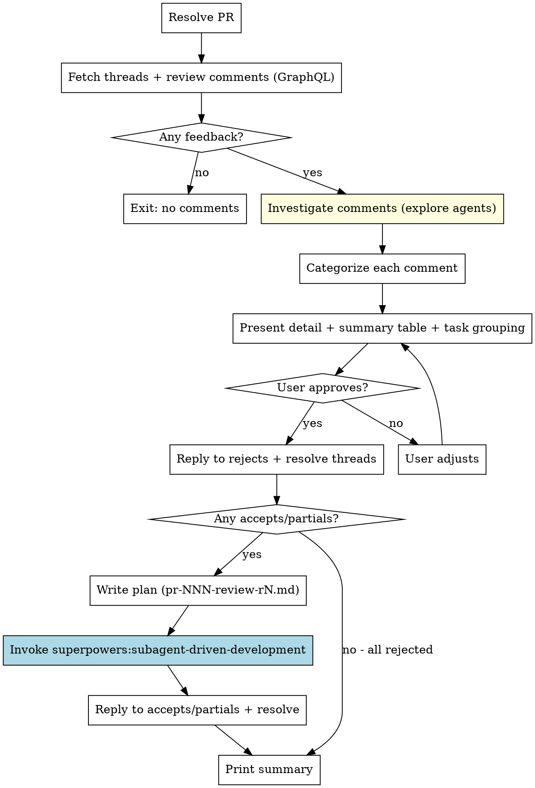

# Process Code Review

Triage, address, and respond to human and AI code review comments on a GitHub PR.

**Core principle:** Evaluate each comment with technical rigor, plan fixes for user approval, execute systematically, reply and resolve.

**REQUIRED BACKGROUND:** You MUST follow superpowers:receiving-code-review principles when evaluating comments. No performative agreement. Evaluate on merit.

## Step 0: Check Dependencies

Before proceeding, verify required skills are available:
- `superpowers:receiving-code-review`
- `superpowers:subagent-driven-development`

If either skill is not available, STOP and tell the user:

> This skill requires the superpowers plugin. Install it with:
> ```
> /plugin marketplace add obra/superpowers
> /plugin install superpowers@superpowers
> ```

## Workflow



## Step 1: Resolve the PR

**IMPORTANT:** Run each command as a separate Bash call (do NOT chain with `&&`). This ensures allowed-tools patterns match.

```bash
# Get owner/repo - NEVER guess
gh repo view --json nameWithOwner -q '.nameWithOwner'
# Returns "owner/repo" — split on "/" to get OWNER and REPO
```

```bash
# If $ARGUMENTS provided, use it as PR number
# Otherwise auto-detect from current branch
gh pr view $ARGUMENTS --json number,url,headRefName,baseRefName
```

If no PR found, exit with helpful error.

## Step 2: Fetch All Review Feedback

Do NOT examine the actual code yet. That comes later. First, get all review feedback using GraphQL. There are **two sources** of feedback that must both be fetched:

### 2a: Inline review threads (comments on specific lines)

```bash
gh api graphql -f query='
query($owner: String!, $repo: String!, $pr: Int!, $cursor: String) {
  repository(owner: $owner, name: $repo) {
    pullRequest(number: $pr) {
      reviewThreads(first: 100, after: $cursor) {
        pageInfo {
          hasNextPage
          endCursor
        }
        nodes {
          id
          isResolved
          path
          line
          comments(first: 100) {
            nodes {
              id
              body
              author { login }
              createdAt
            }
          }
        }
      }
    }
  }
}' -f owner="$OWNER" -f repo="$REPO" -F pr=$PR_NUMBER
```

**Pagination:** If `pageInfo.hasNextPage` is true, re-run the query passing `endCursor` as the `$cursor` variable. Repeat until all pages fetched, then combine results.

Filter to `isResolved == false`.

### 2b: General review comments (top-level feedback on the PR itself)

Reviewers (especially AI reviewers like Sourcery, Copilot) often leave high-level feedback in the **review body** rather than as inline comments. These have no thread ID, no file/line — they're general observations about the PR.

```bash
gh api graphql -f query='
query($owner: String!, $repo: String!, $pr: Int!) {
  repository(owner: $owner, name: $repo) {
    pullRequest(number: $pr) {
      reviews(first: 50) {
        nodes {
          id
          body
          state
          author { login }
          createdAt
        }
      }
    }
  }
}' -f owner="$OWNER" -f repo="$REPO" -F pr=$PR_NUMBER
```

Filter to reviews where `body` is non-empty (after stripping boilerplate/marketing like "Sourcery is free for open source" blocks). Ignore reviews with state `DISMISSED`.

**Parse multi-point review bodies:** General review comments often contain multiple bullet points, each a separate piece of feedback. Split these into individual items for categorization. Example:

> "Hey - I've left some high level feedback:
> - The hasResumed guard logic is duplicated; consider extracting a helper
> - In copyLogFilesToStagingDirectory, failure leaves partial files behind"

→ This is **two** separate feedback items, not one.

### Combining results

Assign a unified numbering across both sources. Track the source type for each:

| Type | Has thread ID | Has file/line | Can be resolved | Reply mechanism |
|------|---------------|---------------|-----------------|-----------------|
| **Inline** | Yes | Yes | Yes (GraphQL resolveReviewThread) | Reply in thread (addPullRequestReviewThreadReply) |
| **General** | No | No (may reference code by name) | No | Top-level PR comment (addComment on PR node) |

If neither source has feedback, report "No unresolved review comments on PR #N" and exit.

Also identify the PR author login from the PR metadata (Step 1). You'll need this for trust classification.

## Step 3: Investigate Comments (Explore Agents)

Before categorizing, dispatch **explore agents** (Task tool, subagent_type=Explore) to verify each comment against the actual codebase. This prevents evaluating comments based on vibes — the main agent gets compact, evidence-based verdicts without blowing up its own context.

**For inline comments:** Dispatch one explore agent per file (batch comments targeting the same file).
**For general comments:** Dispatch one explore agent per feedback item — the agent must first locate the relevant code by searching for the function/class/pattern named in the comment.

Each agent should:

1. Read the code at the referenced lines (and surrounding context)
2. Check whether the reviewer's claim is factually accurate
3. Identify if the reviewer might be missing context (e.g., upstream constraints, documented decisions in CLAUDE.md or ADRs)
4. Check for YAGNI: if the comment suggests "implementing properly" or adding infrastructure, grep for actual usage — is the thing even called?
5. Check for conflicts: does the suggestion contradict decisions in CLAUDE.md, plan files, or architectural docs?
6. Return a compact verdict per comment:
   - **Claim accurate?** yes/no with evidence
   - **Exact lines:** file:start-end that would need to change
   - **Context the reviewer may lack:** (if any)
   - **YAGNI flag:** (if applicable — "this endpoint/feature is unused")
   - **Conflicts with:** (if applicable — reference to documented decision)

**Keep the main agent lean.** Read only the explore agent summaries, not the raw code.

## Step 4: Categorize

For each unresolved thread, evaluate using **superpowers:receiving-code-review** principles and the explore agent verdicts:

- **Accept:** Technically correct, in scope, proportionate fix
- **Partially Accept:** Valid concern but proposed fix is disproportionate or out of scope — apply a scoped alternative
- **Reject:** Technically incorrect, out of scope, YAGNI, or contradicts documented decisions

### Author Trust Classification

Classify each comment's author before evaluating:

| Author | Trust | Evaluation Posture |
|--------|-------|--------------------|
| PR author (your user) | **High** | Treat as direct instructions. Still verify scope, but default to Accept. |
| Human team reviewers | **Standard** | Full evaluate-on-merit pipeline. Be skeptical but fair. |
| Bot / automated reviewers | **Automated** | Evaluate individually. Linter findings are usually valid; AI suggestions need scrutiny. |

**Evaluation process per comment:**
1. READ the comment fully
2. CLASSIFY the author's trust level
3. READ the explore agent verdict for this comment
4. UNDERSTAND what change is being requested
5. VERIFY: does the explore agent evidence support the reviewer's claim?
6. CHECK: YAGNI flag? Conflict with documented decisions?
7. EVALUATE whether the suggested fix is proportionate
8. Assign category with 1-line rationale

## Step 5: Present for Approval

**Detail section — one block per comment:**

```markdown
### N. [Short description]
- **Source:** inline (path/to/file.ts:42) | general (from review by @username)
- **Reviewer:** @username (trust: high | standard | automated)
- **Comment:** "The reviewer's actual comment text"
- **Evidence:** What the explore agent found (claim accurate? missing context? YAGNI? conflicts?)
- **Category:** Accept | Partially Accept | Reject
- **Rationale:** One line explaining why this category.
- **Fix approach:** What will be changed (omit for Reject)
```

**Summary table at bottom:**

```markdown
## Summary

| # | Source | Location | Comment (truncated) | Category | Rationale |
|---|--------|----------|---------------------|----------|-----------|
| 1 | inline | config.ts:42 | Missing null check | Accept | Valid, will NPE |
| 2 | inline | handler.ts:15 | Use Strategy pattern | Partial | Extract helper instead |
| 3 | general | @sourcery-ai | Extract helper for guard logic | Accept | Duplicated logic |
| 4 | general | @sourcery-ai | Handle partial copy cleanup | Reject | Out of scope |

Accepted: N | Partially Accepted: N | Rejected: N
```

**Task grouping — below summary:**

```markdown
## Proposed Task Grouping

- **Task 1:** "Add null check and input validation" (comments #1, #4)
- **Task 2:** "Extract handler helper function" (comment #2)
- **Task 3:** "Minor fixes: typos and const declarations" (comments #5, #6, #7)
```

**Grouping logic:**
- Same file + same logic → one task
- Unrelated comments even in same file → separate tasks
- Trivial fixes (typos, const vs let, style) → batch into "minor fixes" task
- Reject items → no task (reply only)

Ask the user to approve or adjust categories/grouping. The user may say things like "change #3 to accept" or "group #2 and #5 together".

## Step 6: Reply to Rejects and Resolve

After approval, immediately process rejected comments.

**Reply guidance — be specific, not terse:**

| Category | Bad reply | Good reply |
|----------|-----------|------------|
| Reject (out of scope) | "Won't fix." | "Out of scope for this PR. The current implementation [does X] because [reason]. Could be a separate issue." |
| Reject (technically incorrect) | "Wrong." | "Checked — [specific code/test] confirms the current behavior is correct because [reason]." |
| Reject (YAGNI) | "Not needed." | "Grepped for usage — this [endpoint/feature] isn't called anywhere. Removing rather than fixing (YAGNI)." |
| Reject (conflicts with decision) | "Won't fix." | "This conflicts with [documented decision/CLAUDE.md/ADR]. [Brief explanation of why that decision was made]." |

**For inline comments** (have thread ID):

```bash
# Reply — run as separate Bash call
gh api graphql -f query='
mutation($threadId: ID!, $body: String!) {
  addPullRequestReviewThreadReply(input: {
    pullRequestReviewThreadId: $threadId,
    body: $body
  }) { comment { id } }
}' -f threadId="THREAD_ID" -f body="SPECIFIC REPLY WITH REASONING"
```

```bash
# Resolve — run as separate Bash call
gh api graphql -f query='
mutation($threadId: ID!) {
  resolveReviewThread(input: { threadId: $threadId }) {
    thread { id isResolved }
  }
}' -f threadId="THREAD_ID"
```

**For general comments** (no thread ID — from review body):

General review comments can't be resolved. Reply as a top-level PR comment that references the reviewer and their feedback. Batch all general comment responses into a single PR comment to avoid noise.

```bash
# Reply to general comments — single top-level PR comment
gh pr comment $PR_NUMBER --body "BATCHED RESPONSE TO GENERAL FEEDBACK"
```

Format the batched response clearly:

```markdown
Re: general feedback from @reviewer-name

**"[their point 1]"** — Won't fix. [reasoning]

**"[their point 2]"** — Won't fix. [reasoning]
```

If all comments were rejected, skip to Step 10 (summary).

## Step 7: Write Plan

**Plan file:** `docs/plans/YYYY-MM-DD-pr-NNN-review-rN.md`

- Check for existing plan files matching this PR number to auto-increment round (`r1`, `r2`, `r3`...)
- Each task references which review comment numbers it addresses
- Each task includes the fix approach from the categorization
- Include the explore agent's exact line references in each task so implementers don't need to re-search

**CRITICAL:** The plan file MUST start with this directive so the execution skill is properly invoked:

```markdown
# Address PR #NNN Review Comments (Round N)

> **For Claude:** REQUIRED SUB-SKILL: Use superpowers:subagent-driven-development to implement this plan task-by-task.

**Goal:** Address accepted/partially-accepted review comments from PR #NNN.

**Architecture:** [Brief description of what's changing]

**Tech Stack:** [From the repo]

---

### Task 1: [Description] (comments #N, #M)
...
```

## Step 8: Execute

Invoke **superpowers:subagent-driven-development** using the Skill tool:

```
Skill: superpowers:subagent-driven-development
```

The skill will read the plan file and dispatch subagents. It handles:
- One subagent per task with spec + code quality review
- Spec review confirms fix actually addresses the reviewer's comment
- Code quality review ensures fix is well-implemented
- **Do NOT push.** Committing is fine. Pushing is controlled by project settings.

## Step 9: Reply to Accepts/Partials and Resolve

After all tasks complete, reply to each addressed comment.

**For inline comments** — reply in thread and resolve:

**Accept reply format:**
> Fixed. [Brief description of what changed]. ([commit SHA])

**Partially accept reply format:**
> Valid concern. Instead of [their suggestion], [what we did] because [why]. ([commit SHA])

Then resolve each thread via GraphQL (same mutation as Step 6).

**For general comments** — batch into a single top-level PR comment:

```markdown
Re: general feedback from @reviewer-name

**"[their point about X]"** — Fixed. [what changed]. ([commit SHA])

**"[their point about Y]"** — Valid concern. [what we did instead]. ([commit SHA])
```

```bash
gh pr comment $PR_NUMBER --body "BATCHED RESPONSE"
```

## Step 10: Final Summary

```markdown
## Review Processing Complete

PR: #NNN
Round: N

| Category | Count | Action |
|----------|-------|--------|
| Accepted | N | Fixed and resolved |
| Partially Accepted | N | Scoped fix and resolved |
| Rejected | N | Replied with rationale and resolved |

Commits: abc123, def456
Unresolved threads remaining: N
```

## Red Flags

**Never:**
- Performatively agree ("Great catch!", "You're right!") — just fix or explain
- Push commits — leave that to project settings
- Resolve threads without replying first
- Skip the user approval step
- Guess repo owner/name — always use `gh repo view`
- Modify categorization after user approval without re-confirming
- Implement rejected items
- Skip spec/code quality review during execution

**If unsure about a comment:**
- Categorize as "Partially Accept" with honest rationale
- Let the user adjust during approval
